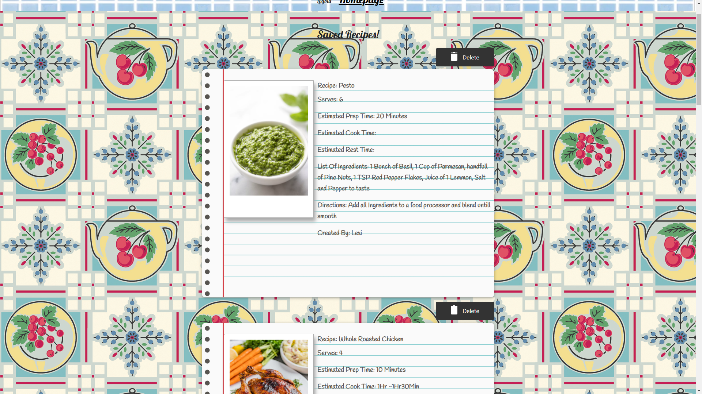
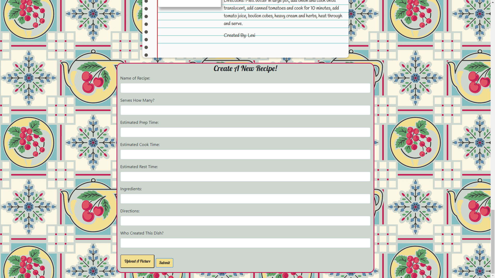

# the-recipe-box 
this is just the finished version of a project hosted at a different repository. Please see that repo for proper credits and work history.

A Link to the original repository can be found here: https://github.com/EthanP94/The-Recipe-Box

# The Recipe Box 

A web application that allows users around the world to share recipes on a public forum that stores nutrional information as well as cooking and prep instructions.

## Table of Contents

- [Tech](#tech)
- [Installation](#installation)
- [Usage](#usage)
- [Contributing](#contributing)
- [Questions](#questions)
- [License](#license)

## Tech
*****

The following technology was used in this project: HANDLEBARS, CSS, JAVASCRIPT, EXPRESS, NODE, BCRYPT, DOTENV, MYSQL and SEQUELIZE

## Installation

---

Being that this is a web application, there is no install necessary!

## Usage

---

In order to use this app, you simply need to go to the website (linked below) and sign up. From there you can view all the stored recipes or contribute your own at the bottom of the homepage. You can also click on an existing recipe to go to a page for that specific recipe to get more information as well as a graph that displays the nutritional information.

## Contributing

---

Being that this is a group project, in order to contribute you would need the permission of all 4 original team members. You can find the emails to reach them at below.

## Images

---

## Questions

---

For any questions you can reach out to any of the original 4 team members:

Jerry

Email: JerryGDev126@gmail.com

GitHub: https://github.com/JGuerrero126

Lexi

Email: alexis.dorrity@gmail.com

GitHub: https://github.com/Lexi-Diamond

Eman

Email: emanconcepcion00@gmail.com

GitHub: https://github.com/Emanconcepcion

Ethan

Email: 

GitHub: https://github.com/EthanP94

## License

---

This project is protected under the Apache license and all relevant protections are granted.
